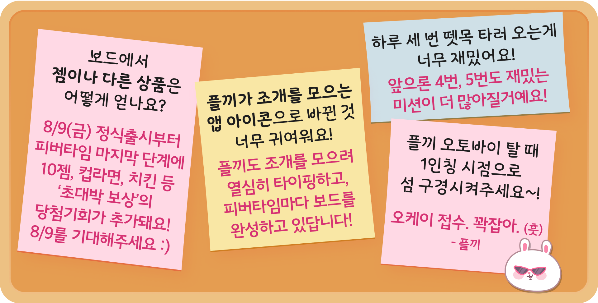

<body>

</body>

### 플키섬의 얼리버드 입주민 여러분들, 반가워요!

*‘미션은 이게 다인가..? 새로운 미션도 추가되려나?’*

*‘플끼는 왜 500타를 달성하면 오토바이를 태워주지?’ ‘엇, 근데 토끼가 운전해도 돼?’*

*‘피버타임은 뭐가 다른거고, 시간대가 언제인거지?’*

플키섬에서 지내며 궁금했던 점들이 있나요?

앞으로 **게시판에 쪽지를 남기면** 플끼가 확인 후 **여기서 답변을 줄게요** ₍ᐢ. ̫.ᐢ₎

### [쪽지 남기는 법]

**❶** 화면 오른쪽 아래 **분홍색 스마일 말풍선💬 버튼** 누르기

**❷ [문의하기→쪽지 붙이기]** 버튼 눌러 쪽지 남겨주기

  

**8/6 화요일**에 첫번째 쪽지들을 모아 답변하러 돌아올게요.

**궁금증이 생길 때마다 언제든, 몇 번이든** 좋으니 게시판에 쪽지를 붙이러 찾아오세요!

  

---

<body>

</body>

### 입주민 유의사항

- 원활한 운영을 위해 닉네임을 유지해주세요.
- 얼리버드는 7.24~8.08 동안 진행돼요.
- 혜택 지급은 얼리버드 종료 후, 8월 2주차에 안내 및 지급돼요.
- 비정상적인 경로로 조개를 모은 경우 정식 출시 시점에 환수될 수 있어요.
- 키테크에 대한 다양한 피드백, 문의사항이 있을 경우 해당 게시판을 통해 언제든지 알려주세요. 플키섬의 발전을 위해 언제나 플끼가 귀 기울이고 있답니다!
